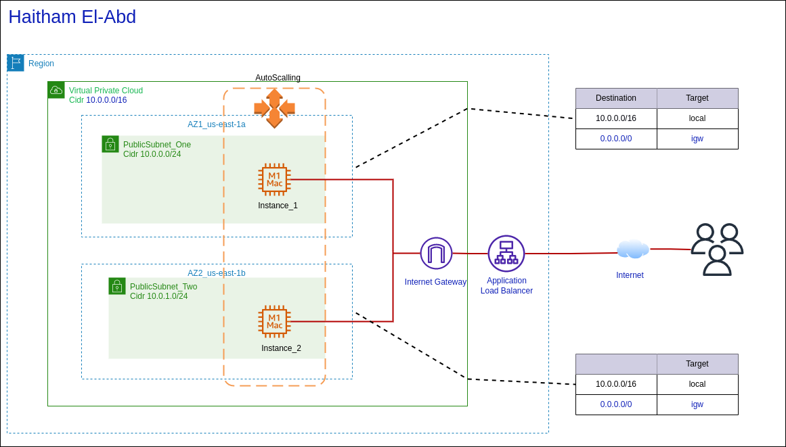

# High Available Website AWS Terraform

  

   Designing of highly available, scalable, manageable and secure web application on Amazon Web Services (AWS) Cloud With Terraform which  is an Infrastructure as Code (IaC) tool that enables automatic deployment and further management of projects architecture. in this project I set up a dynamic AWS Autoscaling Group and Load Balancer with Autoscaling Scaling Policy Resource and a Dynamic Scaling Policy to distribute traffic to  instances in several Availability Zones, The Following photo represent simple infrastructure or project overall picture 



This Project is suitable for scenarios where you have a static web application of dynamic websites like mvc applications in ASP.NET or Django apps , Moreover.  you would generally use such pattern in larger applications, not for small ones or single page applications.

### Resources used:

* Virtual Private Cloud (PVC)
* Public Subnets 
* Security Group
* Launch Configuration
* Auto Scaling Group
* Application Load Balancer 

### Commands to run project 

```bash
terraform init 
terraform plan
terraform apply 
```

### References

* Terraform Documentation Pages 

  https://developer.hashicorp.com/terraform/docs

* AWS Documentation Pages 

  https://docs.aws.amazon.com/index.html

* Terraform: Up and Running: Writing Infrastructure as Code book written  by Yevgeniy Brikman

  

  

  

  

  

  

  

  

  

  

  

